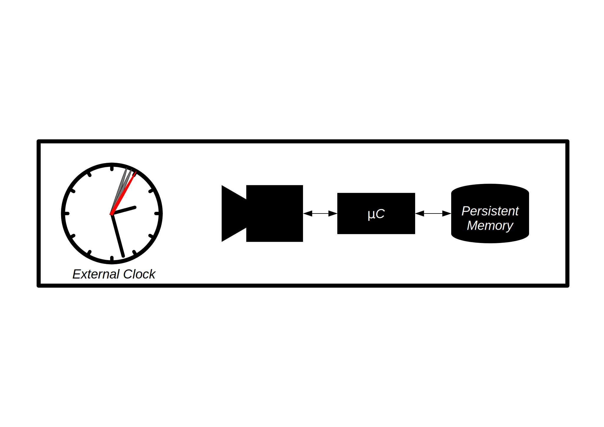

# Synchronome Project

Important milestones are marked via git tags.

*Short Description*:
This project is an exercise in realtime embedded engineering.
An embedded computer connected to a camera periodically takes pictures of a ticking clock and saves them to persistent memory (Flash).
The program outputs one image each second, each showing a still image of the seconds hand in one stationary position.
(or one image each 1/10th of a second if the clock displays 1/10ths of a second).
In order to achieve that, the process of taking/picking pictures needs to be carefully synchronized with the external clock.

This project is the [fourth part](https://www.coursera.org/learn/real-time-project-embedded-systems) of the [Realtime Embedded Systems Specialization](https://www.coursera.org/specializations/real-time-embedded-systems) by the *University of Colorado Boulder* via Coursera.
According to the [course description](https://www.coursera.org/learn/real-time-project-embedded-systems) successful completion of this project proofs advanced level applied knowledge about realtime embedded engineering.

For details about grading and requirements for passing this course, see `./doc/0_requirements.md`.

The System has been demonstrated to run successful in case of the external clock being a 1Hz analog clock as well as the eternal clock being a 10Hz stopwatch with a digital display.
See [./doc/example_output/](./doc/example_output/).

# Documentation

Extended documentation:

- [Requirements](./doc/0_requirements.md)
- [System Design](./doc/1_system-design.md)
- [Scheduling & Timing Analysis](./doc/2_scheduling-and-timing-analysis.md)

Generate .PDF documentation:

    $ ./scripts/create_doc.fish
    $ ls doc/pdf/

## Build

    $ ./scripts/build.fish

## Run

    $ ./scripts/run_synchronome.fish [--help]

## Measure Timing / Statistics

    $ ./scripts/run_statistics.fish

## Run Tests

*Prerequisit*: install the [check](https://libcheck.github.io/check/) test framework

    $ ./scripts/test.fish

## Upload

    $ ./scripts/upload.fish

The script will cd into to the uploaded dir on the REMOTE.
You may now build and run the program there.

*Remark*: create `./local/config/remote.conf` on first run and edit accordingly:

    $ mkdir --parents local/config
    $ cp .example-remote.conf ./local/config/remote.conf

## Developer Notes

Auto run tests before every commit:

    $ git config core.hooksPath hooks

Recommended integrated linter/autocompletion config for vim/neovim:

- [ale](https://github.com/dense-analysis/ale): integrated lint engine for vim/neovim
- [bear](https://github.com/rizsotto/Bear): automatically generate `compile_commands.json` for clang-based linting/analysis tools
