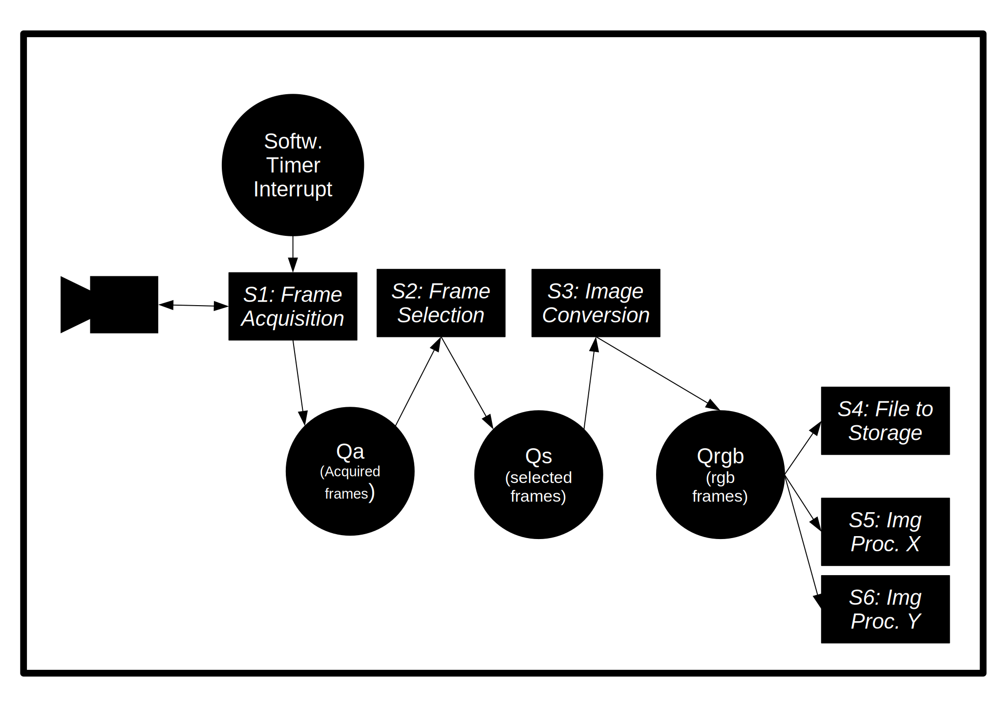

# Synchronome Project - System Design

## Platform Specification

Platform:

- OS: linux
- Board: Raspberry Pi Model 4B
- Camera: C270 HD WEBCAM

## Implementation Details

- Implementation in C
- Frame acquisition from the camera uses the Video for Linux ver.2 API (V4L2) and uses the streaming I/O method aka *memory mapping*
- Frames should *never* be copied but shared/accessed via pointers for performance reasons

## Design Overview



## Resources

Queues are used to decouple read and write access. These are implemented as ringbuffers in user space. A read operation blocks on a semaphore, until the next element is available.

- Camera: repeatedly sampled to acquire frames
- Select State: 
- Qa: buffer of frames acquired from the camera with timestamps (from the linux system clock) attached
- Qs: buffer of selected frames
- Qrgb: buffer of selected frames in rgb format

## Services

*Definitions:*

- Tc := "tick interval of external clock" ( = 1s or 0.1s for target/stretch goal)
- Ta := "acquisition interval" should be an integer multiple >3 of the external clock interval. Let `s_res` be the factor between Ta and Tc:

    s_res * Ta ~ Tc, s_res >= 3, s_res Integer

- We can then define the "internal tick interval" Ti:

    Ti = s_res * Ta

### S1: Frame Acquisition

**Idea:** aquire frames from camera and attach time stamps

```plantuml
start
repeat
:**time** = Clock.get_time();
:**frame** = Camera.get_frame();
note right
blocks until frame has been captured ...
end note
:**frame.time** = **time**;
:push Qa = (frame:Qa);
:Clock.sleep_until(**time**+Ta);
repeat while(true)
```

### S2: Frame Selection (& Tick Recognition)

S2 is started whenever there is a new incoming frame in Qa.
Qa shall then contain the most recent frames up to a number > s_res (older frames will be released):

```plantuml
start
:**n** = 0;
note right
sample/frame numbering
end note
repeat
:wait for a new frame to appera in front of Qa
consider latest frames (frame[0]:frame[-1]:...) = Qa;
partition TickParser {
    if (frame[0] is a tick frame) is (true) then
    :select frame[n-1] or frame[n-2] and add it to Qs;
    endif
}
:**n** ++;
repeat while(true)
```

Therefore each cycle, the service can inspect multiple captured frames from the past:

```plantuml
concise "Frames" as F
scale 1 as 100 pixels

@294

@295
F is "frame[-4]"

@296
F is "frame[-3]" #red

@297
F is "frame[-2]" #yellow

@298
F is "frame[-1]"

@299
F is "frame[0]" #red

@300
F is {hidden}

@297 <-> @300: s_res

highlight 295 to 300 : frames kept in memory

```

Whether frame[0] should be considered a tick frame is to be discussed:

#### Case a) S2 in Sync / Stubborn Mode

If internal and external clocks are in sync, the situation is as follows:


```plantuml
concise "Frames" as F
binary "Internal Tick Ti" as I
binary "External Tick Tc" as C
scale 1 as 100 pixels
legend
    | color | meaning |
    |<#red>    | tick frame |
    |<#yellow>    | selected frame |
end legend

@294

@295
F is "frame[-4]"
I is 0
C is 0

@296
F is "frame[-3]" #red
I is 1
C is 1

@297
F is "frame[-2]" #yellow
I is 0
C is 0

@298
F is "frame[-1]"
I is 0
C is 0

@299
F is "frame[0]" #red
I is 1
C is 1

@300
F is {hidden}
I is {hidden}
C is {hidden}

@297 <-> @300: s_res

highlight 295 to 300 : frames kept in memory
```

In this case, the system could simply run on the internal clock. There would be no need to detect external ticks. 
It would increase the counter n for every incoming frame and assume every frame where the counter is a multiple of s_res to be a tick frame.
Whenever a new tick frame arrives, frame[-2] (the frame after the previous tick) would be selected and send to Qs.

In reality, the situation is more complex.

#### Tick Detection & Drift Correction

Assumptions:

- The internal clock Ti may slowly drift against external clock Tc
- Drifting happens sufficiently slow, such that there is always a period of multiple samples, where the internal clock is only 1 sample ahead or behind the external clock

Idea:

- detect ticks by calculating the sum of pixel-wise difference between adjacent frames
- match every detected external tick frame with a corresponding internal tick frame (at multiples of s_res)
- recognize drift by reacting to multiple detected ticks being earlier/later than the internal tick
- counteract drift by adjusting the sample number n (+1 or -1)

In this more advanced version of the TickParser, we will delay tick selection until 1 frame after the latest internal tick (301 instead of 300, in the diagrams).

##### Case b): int. tick **behind** ext. tick:

if the TickParser has registered to be 1 sample behind the external tick:

- tick selection should lean "left" (as in stubborn mode)
- the internal clock has to be adjusted "left", that means `n --`
- to be robust against occasional jitter or tick detection errors, adjustment should only happen after the drift has been confirmed some nr of samples

```plantuml
concise "Frames" as F
binary "int. tick" as I
binary "ext. tick" as C
scale 1 as 100 pixels
legend
    | color | meaning |
    |<#red>    | tick frame (dirty) |
    |<#orange>    | detected tick frame (dirty) |
    |             | clean frame |
end legend
caption internal clock Ti **behind** Tc

@292
F is "frame[-8]"
I is 0
C is {0,1}

@293
F is "frame[-7]" #red
I is {0,1}
C is 0

@294
F is "frame[-6]"
I is 0
C is 0

@295
F is "frame[-5]" #orange
I is 0
C is {0,1}

@296
F is "frame[-4]" #red
I is {0,1}
C is 0

@297
F is "frame[-3]"
I is 0
C is 0

@298
F is "frame[-2]" #orange
I is 0
C is {0,1}

@299
F is "frame[-1]" #red
I is {0,1}
C is 0

@300
F is "frame[0]"
I is 0
C is 0

@301
F is {hidden}
I is {0,1}
C is {0,1}
note top of F : adjust int. tick <&arrow-left>

@302
I is 0
C is 0

@294 <-> @297: Ti * s_res
@297 <-> @300: Ti * s_res

```

##### Case c) int. tick **ahead of** ext. tick:

Ff the TickParser has registered to be 1 sample behind the external tick:

- tick selection should lean "right", to avoid selecting a "dirty" frame during a tick
- the internal clock has to be adjusted "right", that means `n ++`
- to be robust against occasional jitter or tick detection errors, adjustment should only happen after the drift has been confirmed some nr of samples


```plantuml
concise "Frames" as F
binary "int. tick" as I
binary "ext. tick" as C
scale 1 as 100 pixels
legend
    | color | meaning |
    |<#red>    | tick frame (dirty) |
    |<#orange>    | detected tick frame (dirty) |
    | | clean frame |
end legend
caption internal clock Ti **ahead of** Tc

@293
F is "frame[-7]" #red
I is {0,1}
C is 0

@294
F is "frame[-6]" #orange
I is 0
C is {0,1}

@295
F is "frame[-5]"
I is 0
C is 0

@296
F is "frame[-4]" #red
I is {0,1}
C is 0

@297
F is "frame[-3]" #orange
I is 0
C is {0,1}

@298
F is "frame[-2]"
I is 0
C is 0

@299
F is "frame[-1]" #red
I is {0,1}
C is 0

@300
F is "frame[0]" #orange
I is 0
C is {0,1}

@301
note top of F : adjust int. tick <&arrow-right>
F is {hidden}
I is 0
C is 0

@302
I is 0
C is 0

@303
I is {0,1}
C is {0,1}

@304
I is 0
C is 0

@294 <-> @297: Ti * s_res
@297 <-> @300: Ti * s_res

```

#### Robustness to Tick Detection Errors

Tick detection may be unreliable for short periods (additional ticks, missing ticks).

This is recognized by the TickParser, whenever the 1-to-1 correspondence of internal and external ticks cannot be maintained.
The system then goes into stubborn mode a), ignores detected ticks and frame selection is then based on the internal ticks.
As soon the tick detection becomes reliable, the system will again take into account detected ticks for synchronization.

### S3: Image Conversion

**Idea:**

- Keep it simple

```plantuml
start
repeat
:get next (**frame**:**rest**) = Qs;
:calculate **frame_rgb** from **frame**;
:Qrgb = (**frame_rgb**:Qrgb);
:delete Qs = **rest**;
repeat while(true)
```

### S4: File To Storage & S5,...: Other Image Processing

**Idea:**

- Keep it simple

```plantuml
start
repeat
:get next **frame_rgb** from Qrgb;
:save **frame_rgb** to filesystem;
:vote for deletion of **frame_rgb** from Qrgb;
repeat while(true)
```

Other image processing tasks S5,... have a similar control flow with a different action instead.

**Notes:**

- deletion of frames from Qrgb is postponed until all Services (S4,S5,...) have agreed.
