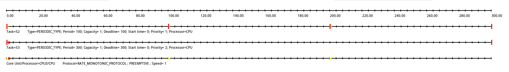
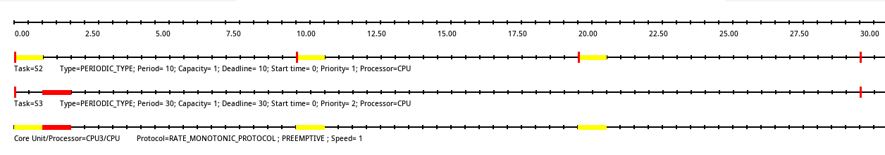

# Synchronome Project - Timing Analyis

*Definitions:*

- Tc := "tick of external clock" ( = 1s or 0.1s for target/stretch goal)
- Ta := "acquisition rate" ( < 1/2 * Tc, preferrably < 1/3 * Tc )

The preliminary system design is built on the following services:

- S1: Frame Acquisition
- S2: Tick Recognition
- S3: Image Conversion
- S4: Files to Storage
- S5, ...: Other Image Processing Tasks

## Measured Worst Expected Computation Time (WECT)

Running the `./scripts/run_statistics` on the destination platform prints information about the platform and tests for the worst-case and average runtime for relevant cpu-intensive parts of the services described.
The camera supports many frame sizes and framerates. Therefore, a selection of representitive cases is chosen:

| service: task            | 320x240                       | 640x480                       | 1280x960                      |
|--------------------------|-------------------------------|-------------------------------|-------------------------------|
| S1: camera_get_frame     | max: 0.068028s avg: 0.066803s | max: 0.067995s avg: 0.066800s | max: 0.143959s avg: 0.141613s |
| S2: image_diff           | max: 0.001505s avg: 0.001478s | max: 0.006652s avg: 0.006592s | max: 0.041315s avg: 0.041092s |
| S3: image_convert_to_rgb | max: 0.001124s avg: 0.001094s | max: 0.015134s avg: 0.005367s | max: 0.031482s avg: 0.018423s |
| S4: image_save_ppm       | max: 0.017130s avg: 0.010344s | max: 0.117209s avg: 0.045070s | max: 0.239186s avg: 0.207855s |

## Services Timing Specifications:

For the following discussion, we assume that for each service the deadline is equal to its period: D = T.
S1, S2 and S3 are considered critical Services. The deadline is determined by the functional requirements:
In order to guarantee at least 1 frames between ticks and to fulfill the additional target requirement to measure and control drift, Ta should be less than half of a clock tick, preferrably Ta <= 1/3 * Tc.
S4 and others are not critical for synchronization issues and may therefore run as best effort services. In order to prevent data overflow, the period is required to be less than Tc *on average*.
In summary, we get:

| Deadline/Period | S1 | S2 | S3 | S4 |
|-----------------|----|----|----|----|
| T               | Ta | Ta | Tc | Tc |
| CPU             | 2  | 3  | 3  | 4  |

For the minimal objectives Tc = 1s and taking into account the measured WECT for 320x240, we get:

| Parameters | S1    | S2    | S3    | S4    |
|------------|-------|-------|-------|-------|
| T in s     | 1/3   | 1/3   | 1     | 1     |
| C in s     | 0.068 | 0.002 | 0.001 | 0.017 |
| U in %     | 20%   | 0.45% | 0.11% | 1.71% |

For the target/stretch goals Tc = 0.1s, we get:

| Parameters | S1      | S2    | S3    | S4     |
|------------|---------|-------|-------|--------|
| T in s     | 1/30    | 1/30  | 0.1   | 0.1    |
| C in s     | 0.068   | 0.002 | 0.001 | 0.017  |
| U in %     | 204.08% | 4.52% | 1.12% | 17.13% |

Under the assumption, that the technical issue with S1 can be fixed, 

## Feasibility

### S1 and S4

S1 and S4 occupy one core on their own. Therefore they must fulfil the trivial constraint U < 1.
For the Tc = 1s case this is obviously the case.
In case of Tc = 0.1s, feasibility depends on finding a solution to drop the minimum sample interval of the camera below 0.03s (or at least below 0.05s).

### S2 and S3

S2 and S3 share core 3.
According to the [Liu & Layland paper [1]](#references), feasibility is guaranteed for rate-monotonic (shortest-deadline-first) policy, as long as the total utilization below the least upper bound. For 2 processes, this criteria evaluates to:

U_{total} < LUB = 2*(2^(1/2) - 1) = 0.83

Plugging the measured WCET and periods as specified above proofs that processing is feasible for the relevant cases:

- Case 320x240, Ta = 1/3:
    - Utilization U = U2 + U3 = 0.564% 
- Case 320x240, Ta = 1/30:
    - Utilization U = U2 + U3 = 5.639%

Even if we add lots of margin and consider C2 = 0.01 and U3 = 0.01, we are still below the LUB:

- Case Ta = 1/3:
    - U2 = 0.01 / (1/3) = 3%
    - U3 = 0.01 / 1 = 1%
    - Utilization U = U2 + U3 = 4%
- Case Ta = 1/30:
    - U2 = 0.01 / (1/30) = 30%
    - U3 = 0.01 / (1/10) = 10%
    - Utilization U = U2 + U3 = 40%

Timing diagrams for these cases (units are 1s/300):

## Open Problems and Challenges

This analysis is based on a preliminary design. Open problems still exist that will need to be figured out during development, ie:

- The [measurements](#measured-worst-expected-computation-time-wect) show that the shortest possible frame interval of the camera is ~0.06s, despite the fact the driver lists intervals down to 0.03s. This is a problem for the target/stretch goal, where the external clock tick Tc is 0.1s. A frame interval below 1/2, preferrably 1/3 is necessary
- In contrast to rate monotonic theory, services depend on each other through shared resources, namely frame buffers. Therefore, it is yet to be shown that scheduling always succeeds and deadline constraints will be met in all circumstances

## References

- [1] Liu, C. L.; Layland, J. (1973), "Scheduling algorithms for multiprogramming in a hard real-time environment", Journal of the ACM, 20 (1): 46–61, CiteSeerX 10.1.1.36.8216, doi:10.1145/321738.321743 
