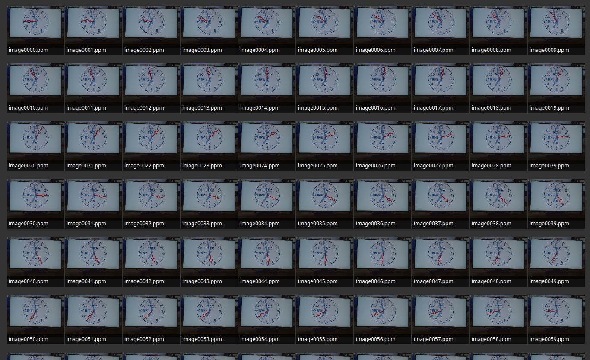
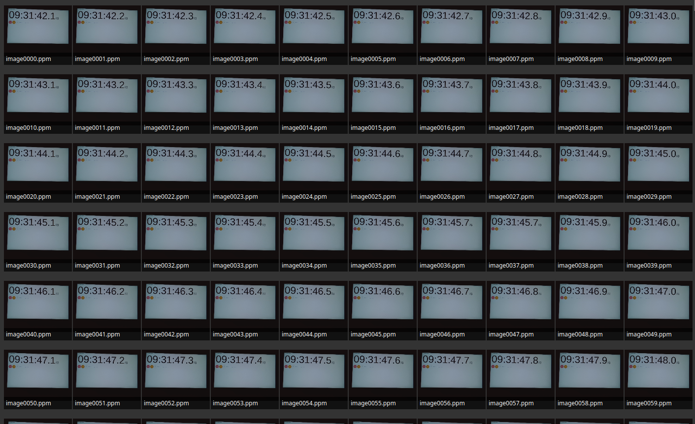

# Synchronome Project - Conclusion

The Program has successfully been tested running on the specified platform (Linux + Raspberry Pi Model 4B + C270 HD Webcam) at a resolution of 320x240 for Ta = (1/3)s & Tc = 1s and Ta = (1/30)s & Tc = (1/10)s.

Example output and logfiles are in the `./doc/examples/` directory.

## Results and Outlook

- File I/O to the Flash drive is the main bottleneck
- Logging and tracing to the file system introduces competetion for the file system. Decoupling logging into a seperate thread is decisive to prevent erratic blocking of real-time services when logging

# References

- [1] Liu, C. L.; Layland, J. (1973), "Scheduling algorithms for multiprogramming in a hard real-time environment", Journal of the ACM, 20 (1): 46–61, CiteSeerX 10.1.1.36.8216, doi:10.1145/321738.321743 

## Software Development Stack

Editor:

- (neo)vim editor
- ALE plugin for vim
- vimspector integrated debugger for vim

Documentation in PDF format uses the following tools:

- [pandoc universal document converter](https://pandoc.org/)
- [Eisvogel Template](https://github.com/Wandmalfarbe/pandoc-latex-template)
Creating uml diagrams from descriptions:

- [plantuml](https://plantuml.com)
- [pandoc-plantuml](https://github.com/timofurrer/pandoc-plantuml-filter)

Rendering diagrams from runtime traces:

- gnuplot
- fish
- awk 
